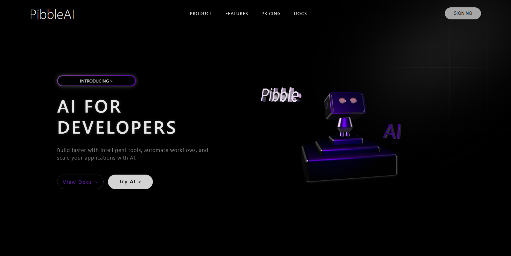

# 🚀 AI FOR DEVELOPERS

Uma landing page moderna e futurista para uma plataforma de Inteligência Artificial voltada para desenvolvedores.

O projeto apresenta um design minimalista com elementos 3D interativos utilizando Spline, focado em performance, estética e experiência do usuário.

---

## 🧠 Sobre o Projeto

O **AI FOR DEVELOPERS** é uma interface inspirada em produtos SaaS modernos, com o objetivo de simular uma plataforma que ajuda desenvolvedores a construir aplicações mais rápido usando IA.

O destaque principal é a integração de um modelo 3D interativo, criando uma experiência visual mais imersiva.

---

## ✨ Funcionalidades

- 🎨 Layout moderno e responsivo
- 🤖 Integração com modelo 3D (Spline)
- 💡 Design inspirado em SaaS futuristas
- ⚡ Estrutura leve e rápida
- 🖱️ Elementos interativos e animações

---

## 🛠️ Tecnologias utilizadas

- HTML5
- CSS3
- JavaScript
- Spline (3D Viewer)

---

## 📸 Preview

---

## 🎯 Objetivo

Este projeto foi desenvolvido com o objetivo de:

Praticar front-end moderno

Trabalhar com integração de elementos 3D

Criar um projeto de nível portfólio

Melhorar habilidades em UI/UX

---

## 👨‍💻 Autor

Desenvolvido por Dzk

📌 Estudante de Ciência da Computação
📍 UVV - Universidade Vila Velha
